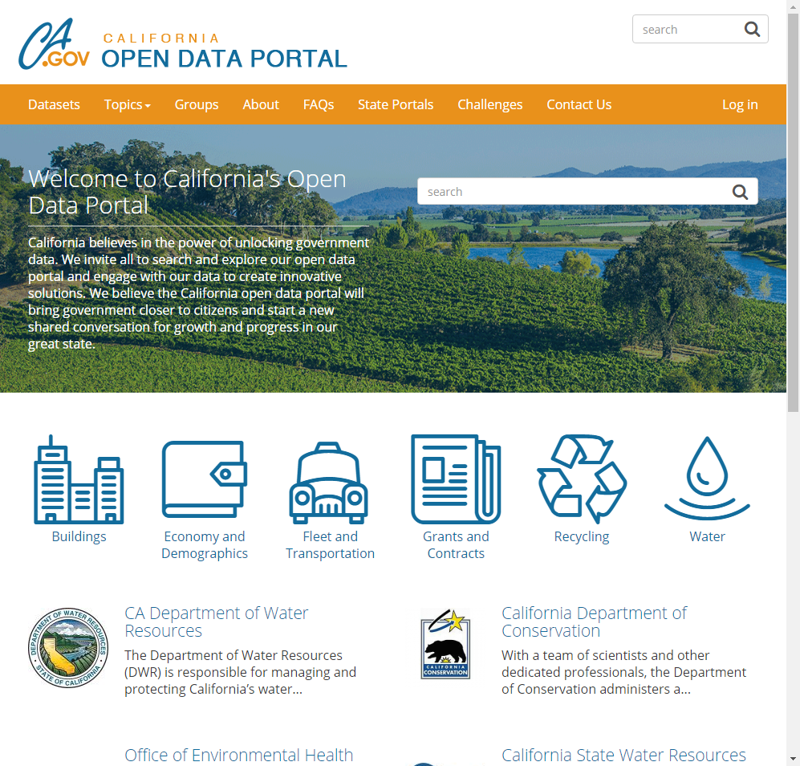
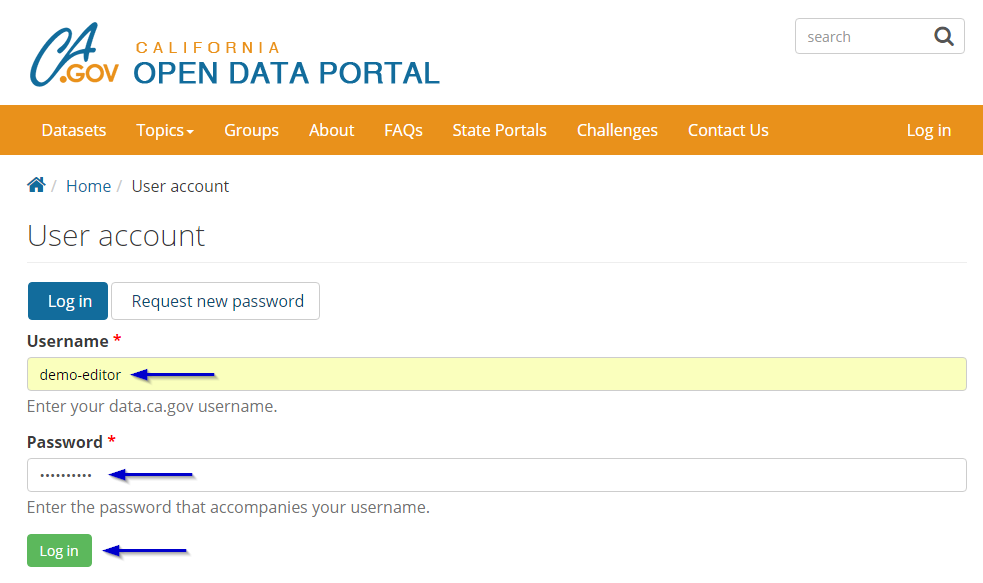
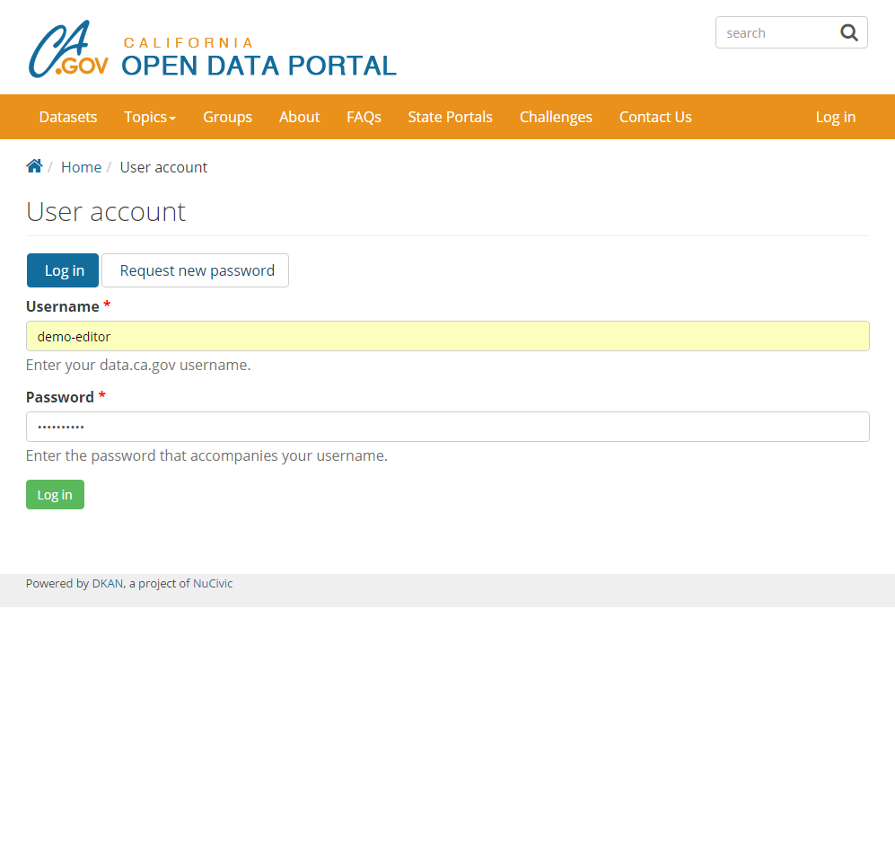
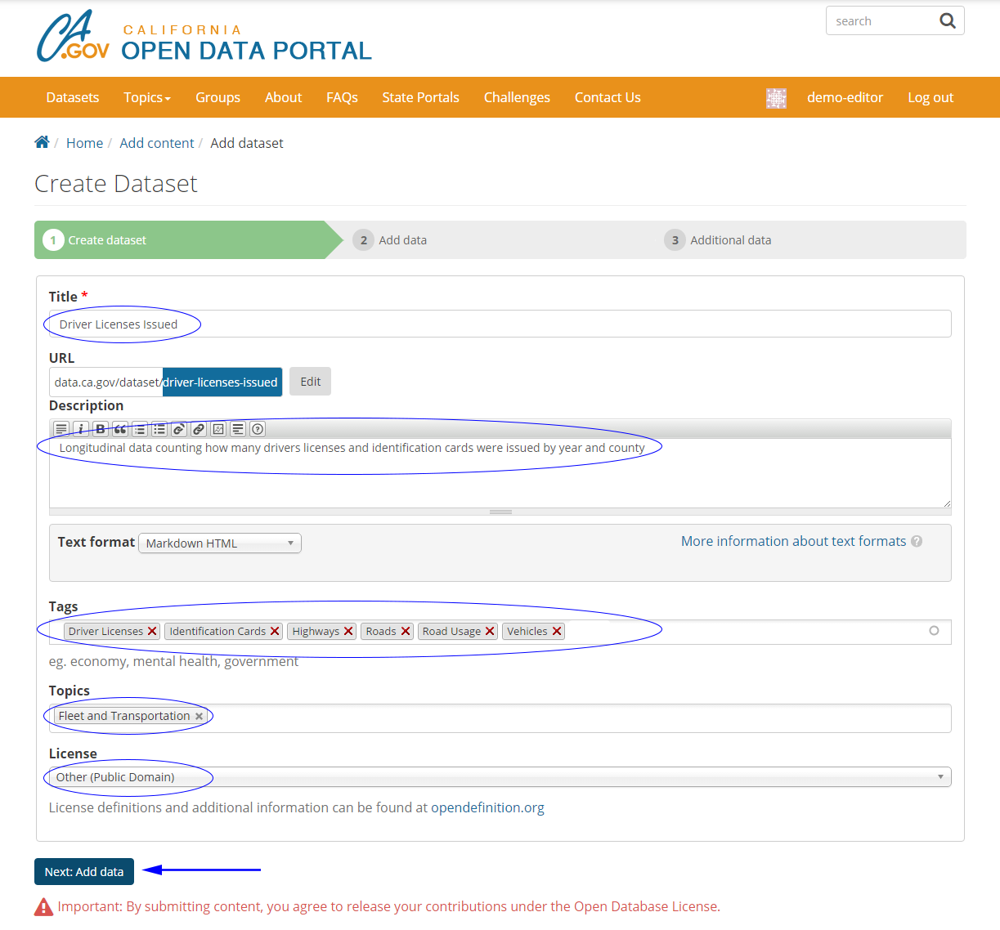
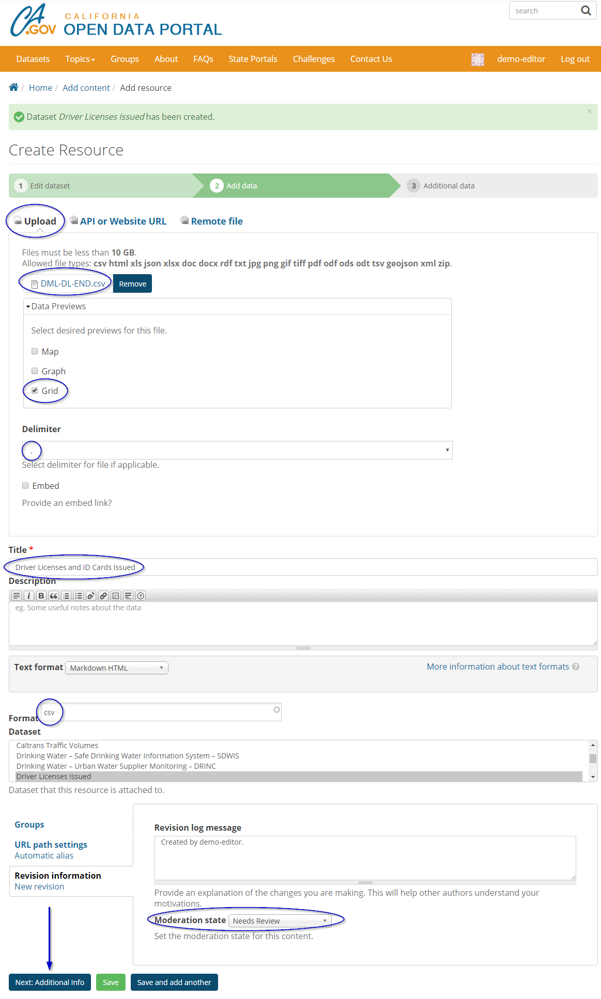
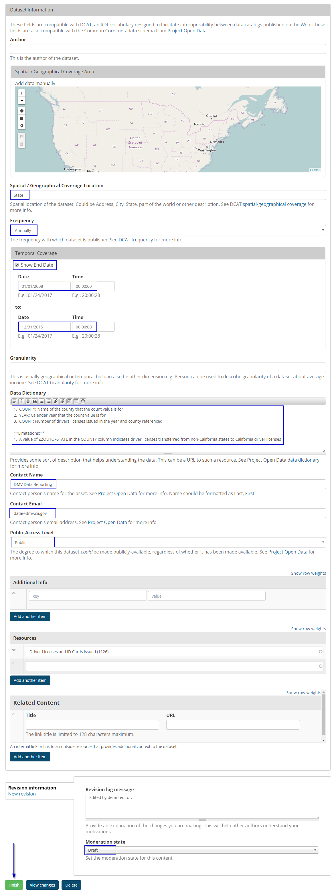

## CA Open Data publishing is controlled through a sequential workflow. As a data coordinator or steward, you will be assigned one of these two roles:

1. **Content Creator, Workflow Contributor**  
This role is assigned to department level data specialists who create and upload datasets.

2. **Editor, Workflow Moderator**  
This role is assigned to department level data steward who reviews and approves data prior to release.

## To begin the process of uploading a dataset, see the below steps:

#### **Step 1: Visit the California Open Data Portal [(https://data.ca.gov)](https://data.ca.gov) and click "Log In"**  

#### **Step 2: Enter your User Name and Password and click the green "Log In" button.**

#### **Step 3: Once logged in, the user profile page will be displayed. Using the top menu bar select [Content > Add Content > Dataset].**

#### **Step 4: From the Create Dataset page, populate the following metadata fields then click 'Next: Add data'**

1. Title
    - Do not include references to CA or California, this will be addressed in upcoming fields
    - Do not include temporal (time) references, this will be addressed in upcoming fields
1. URL
    - Do NOT modify this field
1. Description
    - Brief description of the data, including references to associated legislation (such as assembly bill 1755 for water data)
    - Do not include data dictionary or data limitations, these will be addressed in upcoming fields
1. Text format
    - Do NOT modify this field
1. Tags
    - Tags are keywords that allow data to be easily found
    - Start typing and available tags will automatically appear for selection
    - Separate tags with commas
    - Do NOT create new tags! If new tags are required, a request can be submitted by your department data coordinator
    - Use a minimum of 4-5 tags
1. Topics
    - Broad category in which the data falls, such as 'Water' and 'Buildings'
    - Place your mouse cursor into the box to see available selections
    - Generally only ONE topic will be selected, contact your departmental data coordinator if more than one topic is being considered
1. License
    - Select 'Other (Public Domain)'

#### **Step 5: From the add data page, populate the following metadata fields then click 'Next: Additional Info'**

1. Upload
    - Select tabular data or shapefile to upload
    - Do NOT use the 'API or Website URL' or 'Remote file' options at this time
2. Data Previews
    - Select 'Grid' if the data is tabular
    - Do NOT use the 'Map' or 'Graph' options at this time
3. Delmiter
    - For tabular data, select the appropriate delimiter character
4. Embed
    - Do NOT use this field at this time
5. Title
    - Enter a title for the RESOURCE, this is different from the title for the DATASET but may be similar
    - For example, if the over-arching DATASET title is "Driver Licenses Issued" the title of the RESOURCES may be:
        -  "Driver Licenses and ID Cards Issued **Data File**"
        -  "Driver Licenses and ID Cards Issued **Data Dictionary**"
6. Description
    - A brief description of the resource, this can be omitted if the title is sufficiently self explanatory
7. Text Format
    - Do NOT modify this field
8. Format
    - Select the appropriate file extension
9. Dataset
    - Do NOT modify this field
10. Revision Information
    - Change 'Moderation State' to Needs Review once ready to be reviewed by the departmental data coordinators

#### **Step 6: From the additional data page, populate the following metadata fields then click 'Finish'**

1. Author 
    - Do NOT use this field at this time
2. Spatial/Geographical Coverage Area
    - Do NOT use this field at this time
3. Spatial/Geographical Coverage Location
    - Enter State if data is statewide, otherwise leave blank
4. Frequency
    - Enter frequency of data updates if known
5. Temporal Coverage
    - If data covers start/end dates, enter them here in the format mm/dd/yyyy hh:mm:ss
    - These fields are optional but if a date is entered a time must be entered as well
6. Granularity
    - Do NOT use this field at this time
7. Data Dictionary
    - Enter data definitions and known limitations as needed
8. Contact Name
    - Enter the general GROUP name that manages this data, NOT a individual person's name
9. Contact Email
    - Enter the general GROUP email that manages this data, NOT a individual person's email
10. Public Access Level
    - Choose Public, if there are concerns about the privacy or contents of the data, contact your department data coordinator prior to submitting or uploading any data
11. Additional Info
    - Do NOT use this field at this time
12. Resources
    - Do NOT use this field at this time, it will be auto populated
13. Moderation State
    - Once ready for review by department data coordinator(s) set this to Needs Review