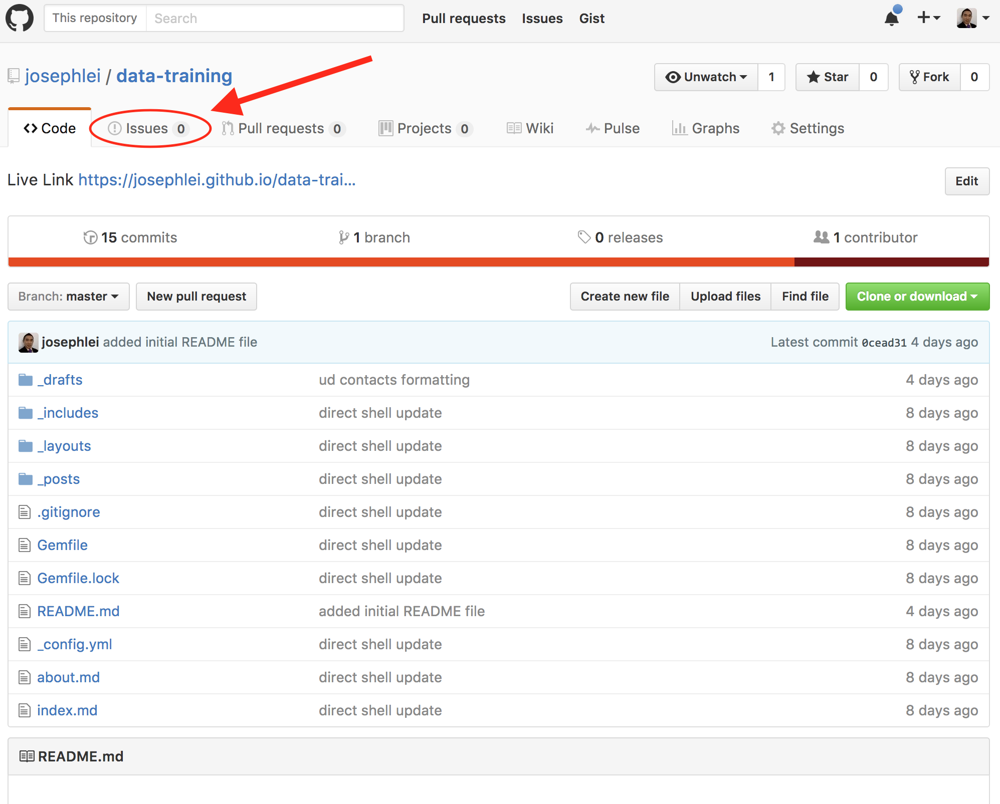
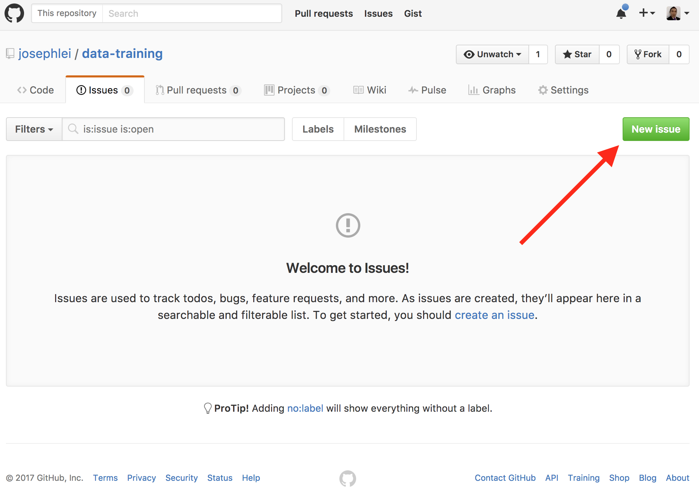
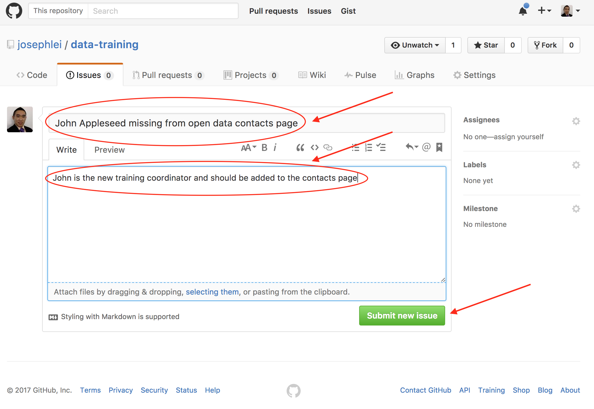

#### If there is a error or suggested update, please follow the steps below to submit a issue so it may be corrected:

#### **Step 1: Visit the GitHub repository that powers this website, currently this is:** [https://github.com/josephlei/data-training](https://github.com/josephlei/data-training)

#### **Step 2: Click on the "Issues" tab shown below**

#### **Step 3: Click the green "New Issue" button**

#### **Step 4: Fill out a title and extended description if necessary**

#### **Step 5: Click the green "Submit new issue" button**

